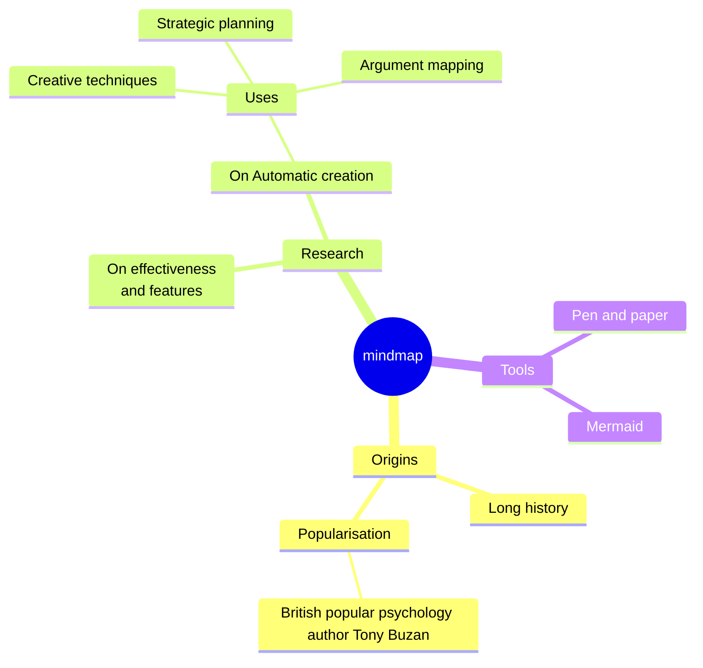
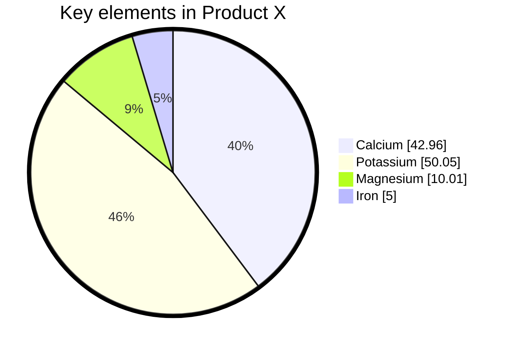

# Títulos y subtítulos en markdown 🤡

Para colocar títulos y subtítulos en `markdown` se ocupa en *hash* `#`, al **INICIO DE LA LÍNEA**.

- Titulo -> `#`
- Subtitulo -> `##`
- Sub-subtitulo -> `###`
- Tenemos hasta 6 niveles de subtítulos -> `######` 

> *Después, del hash va un espacio*

## Recomendaciones de los titulo y subtítulos

- Solo debe haber un titulo por archivo
- Después del titulo, debe ir un subtitulo, es decir; no puede haber sub-subtitulo entre titulo y subtitulo.
    ```markdown
    # titulo

    texto .....

    ### esto no debe ir aquí

    ## Subtitulo
    ```



