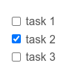

# Listas

Tenemos dos tipos de listas, una lista ordenada y otra NO ordenada.

## Listas NO ordenadas 

Este tipo de listas son genéricas, solo para indicar un listados de cosas, que no tienen un orden especifico.
Para definir estas listas se pueden usar diferentes símbolos, **AL INICIO DE LA LÍNEA**, y *se deja un espacio*:

- **guion medio**: `-`
- **símbolo de suma**: `+`
- **asterisco**: `*`

**Ejemplos**:

*Con guion medio*:

`-` item 1 
`-` item 2 
`-` item 3 

*Con símbolo de más*:

`+` item 1 
`+` item 2 
`+` item 3 

*Con asterisco*:

`*` item 1 
`*` item 2 
`*` item 3 

**Resultado**:

- item 1
- item 2 
- item 3

## Lista Ordenada

Este tipo de listas con un orden o numeradas, solo para indicar un listados con orden, que no tienen un orden especifico.
Para definir estas listas usan números, **AL INICIO DE LA LÍNEA Y UN PUNTO**, y *se deja un espacio*:

**Ejemplo**:

1. item 1
2. item 2
3. item 3

> 📝 ***Nota**: De manera natural no se puede cambiar el primer numero, es decir, siempre sera 1, aunque yo ponga otro. Pero, en ocasiones depende de la herramienta que haga la conversión*.

> :warning: Cuidado: En el listado no puedes dejar un enter de más, porque se parte la lista.

## Listas anidadas

Las listas se pueden combinar y anidar. Es decir, una una sub-lista dentro de una lista, puede ser ordenada o no.
Aquí lo importan o lo clave es la indentation o los espacios entre una y otra.

**Ejemplo:**

1. Item 1
    - Item 1.1
    - Item 1.2
    - Item 1.3
2. Item 2
   1. Item 2.1 
   2. Item 2.2
      - Item 2.2.1 
      - Item 2.2.2 
   3. Item 2.3 
      1. Item 2.3.1
      2. Item 2.3.2
3. Item 3
4. Item 4

> 📔 **Nota:** La indentación o el espacios puede ser de 2 o 4 espacios.

## Lista de tareas (checkbox)

Es una lista no ordenada que puedes marcar o desmarcar.
Para definir estas listas de tareas usa un guion medio, un espacio, un corchetes cuadrados (dejando un espacio dentro o agregas un `x`) , **AL INICIO DE LA LÍNEA**, y *se deja un espacio*:

**Ejemplo:**

`- [ ]` task 1

`- [x]` task 2

`- [ ]` task 3

**Resultado:**

- [ ] task 1
- [x] task 2
- [ ] task 3

> 📝 **Nota:** Si no se ve de manera correcta, es que la herramienta que renderiza el HTML, no tiene el plugin
