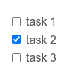

# Enlaces e Imágenes

## Enlaces

Un enlace es un `hipervínculo`, es para que nos enlace a otro sitio o alguna otra página dentro de nuestra documentación.
La sintaxis es, colocar corchetes cuadras, en estos corchetes se coloca lo que vera el usuario, seguido se colocan paréntesis y aquí va la URL de la página.

**Ejemplo:**

```markdown
[ir al inicio](index.md)

[Mecatrónica 85](https://mecatronica85.com)
```

**Resultado:**

[ir al inicio](index.md)

[Mecatrónica 85](http://mecatronica85.com)


## Imágenes

Las imágenes por default, se van colocar una arriba de otra.
La sintaxis es, colocar un signo de admiración, seguido corchetes cuadras, *en estos corchetes se coloca la descripción de la imagen*, seguido se colocan paréntesis y aquí va la URL de la imagen.
Los formatos de la imágenes que soporta son las misma que en `HTML`.(`png`, `jpeg`, `svg`, `webp`, y otras )

**Ejemplo:**

```markdown





```
**Resultado:**


